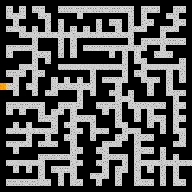
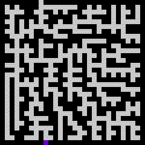
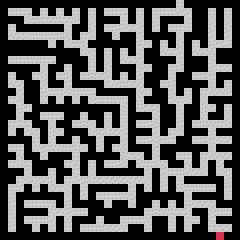
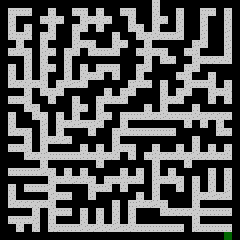
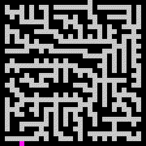
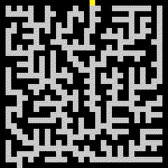
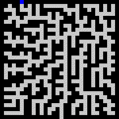
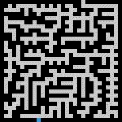
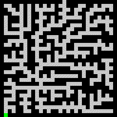

# Maze Pathfinding Generator/Tester

## Introduction

Python source code for testing different pathfinding algorithms against a randomly generated maze.

  
  
   
  
  
   
  
  
   
  
  <i>Sample results</i>

